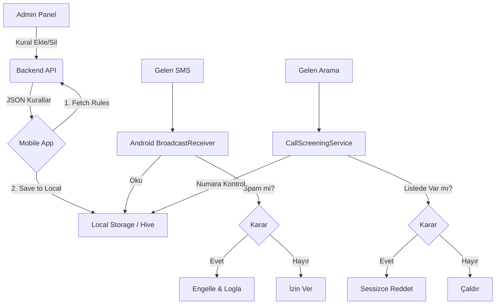

# Spam Filtreleme Sistemi - Mimari Dokümantasyon

## 1. Genel Bakış
Bu sistem, merkezi bir yönetim panelinden belirlenen spam kurallarını (numaralar, anahtar kelimeler) mobil uygulamalara dağıtan ve mobil cihaz üzerinde çevrimdışı (offline) olarak SMS ve aramaları filtreleyen hibrit bir yapıdır.

## 2. Sistem Bileşenleri

### A. Backend (Sunucu)
- **Rolü:** Kuralların tek gerçek kaynağı (Source of Truth).
- **Teknoloji:** Node.js (NestJS) + PostgreSQL/MongoDB.
- **Güvenlik:**
  - Kullanıcı verisi (SMS/Arama logları) ASLA sunucuya gönderilmez.
  - Sadece Admin -> Mobile yönünde veri akışı vardır.
  - Telefon numaraları veritabanında SHA-256 hashli tutulabilir (opsiyonel, admin panelde görmek isteniyorsa şifreli tutulmalı).

### B. Web Admin Panel
- **Rolü:** Operatörlerin spam kurallarını girdiği arayüz.
- **Teknoloji:** Next.js / React.
- **Fonksiyonlar:**
  - Kara liste (Blacklist) yönetimi.
  - Keyword (Regex destekli) yönetimi.
  - Acil durum yayını (Push Notification ile sync tetikleme).

### C. Mobile App (Flutter + Native Android)
- **Rolü:** Kuralları indirmek ve işletmek.
- **Yapı:**
  - **Flutter:** UI, Ayarlar, Kural Senkronizasyonu (Sync), Local DB (Hive).
  - **Android Native (Kotlin):**
    - `BroadcastReceiver`: SMS geldiğinde uyanır, Flutter tarafındaki Hive veritabanını (veya paylaşılan bir JSON dosyasını) okur, karar verir.
    - `CallScreeningService`: Arama geldiğinde numarayı kontrol eder, gerekirse reddeder.

## 3. Veri Akış Şeması

## 4. Teknik Kısıtlar ve Çözümler

### Sorun 1: Android Native servislerin Flutter Hive verisine erişimi
Flutter Hive kutuları (boxes) dart-spesifik formatta olabilir. Native taraftan bunlara erişmek zordur.
**Çözüm:** Flutter, kuralları indirdikten sonra Native tarafın kolayca okuyabileceği ortak bir `rules.json` dosyasına veya `SharedPreferences`'a yazar. Bu projede **SharedPreferences** (veya JSON dosyası) köprüsü kullanılacaktır.

### Sorun 2: Uygulama Kapalıyken Çalışma
BroadcastReceiver ve CallScreeningService, uygulama UI'ı kapalı olsa bile OS tarafından tetiklenir. Bu yüzden filtreleme mantığı **saf Kotlin** ile yazılmalı ve Flutter motorunu ayağa kaldırmaya ihtiyaç duymadan (headless) çalışabilmelidir. Bu pil ömrü ve performans için kritiktir.

### Sorun 3: Google Play Politikaları
SMS ve Arama izinleri "Hassas İzinler" sınıfındadır. Uygulamanın **varsayılan SMS uygulaması** ve **Caller ID / Spam uygulaması** olarak set edilmesi gerekir.
